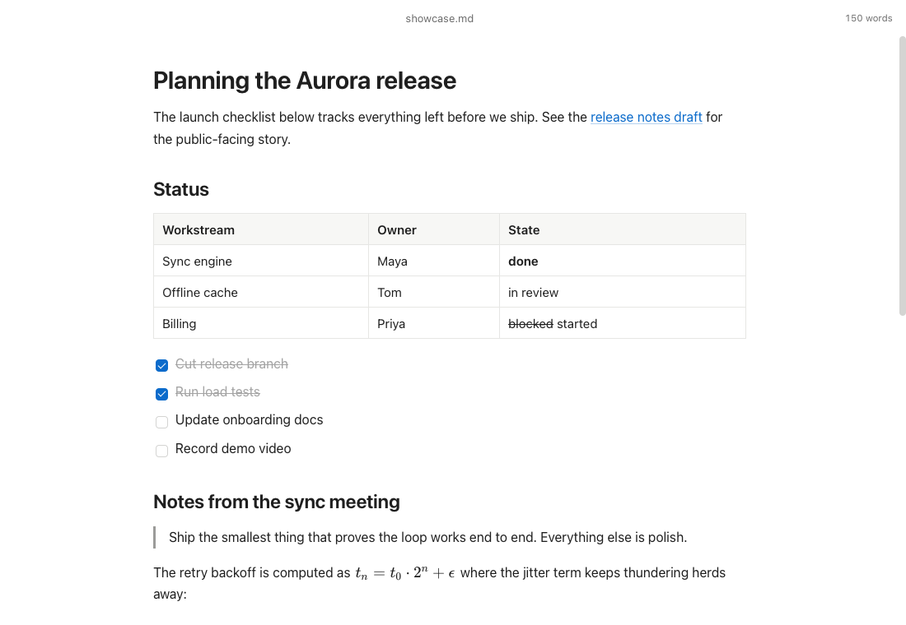

<p align="center">
  
</p>

<h1 align="center">Quill</h1>

<p align="center">
  A fast, native markdown editor for macOS.<br/>
  WYSIWYG editing with LaTeX math, syntax highlighting, and a 4.6 MB download.
</p>

<p align="center">
  <a href="#install">Install</a> &middot;
  <a href="#features">Features</a> &middot;
  <a href="#benchmarks">Benchmarks</a> &middot;
  <a href="#development">Development</a>
</p>

---

## Install

Download the latest `.dmg` from [Releases](https://github.com/ETM-Code/quill/releases), or build from source:

```bash
bun install
bun run tauri build
```

The `.app` bundle and `.dmg` installer will be in `src-tauri/target/release/bundle/`.

## Features

- **WYSIWYG markdown** — Write in rich text, save as `.md`. Headings, bold, italic, lists, blockquotes, code, links.
- **LaTeX math** — Inline `$E=mc^2$` and block `$$...$$` equations rendered live via KaTeX.
- **Syntax highlighting** — Code blocks with language detection. Lazy-loaded so it doesn't slow down launch.
- **Light & dark mode** — Follows your system appearance automatically.
- **Native macOS** — Overlay titlebar with traffic lights. File associations for `.md`, `.markdown`, `.txt`.
- **Tiny footprint** — 11 MB app bundle, 4.6 MB DMG. Half the size of MacDown.

## Benchmarks

Time from `open -a Quill.app` to window visible, averaged over 5 runs (Apple M3, macOS 26.2):

| Test | Quill | MacDown |
|------|------:|--------:|
| Empty launch | **543ms** | 769ms |
| Open 720B note | **602ms** | 646ms |
| Open 14KB document | 698ms | **625ms** |
| Open 214KB document | 2349ms | **674ms** |

Quill launches ~30% faster than MacDown for new documents. For large files (200KB+), MacDown is faster because it renders a plain text editor + HTML preview pane, while Quill parses the entire document into a rich WYSIWYG editor DOM.

**Size comparison:**

| | Quill | MacDown |
|---|---:|---:|
| App bundle | **11 MB** | 22 MB |
| DMG | **4.6 MB** | — |

## How it works

Quill is a [Tauri 2](https://tauri.app) app. The backend is Rust; the frontend runs in the system WebKit view (no bundled browser engine). The editor is [Tiptap](https://tiptap.dev) (ProseMirror) with the [Markdown extension](https://tiptap.dev/docs/extensions/markdown) for round-trip `.md` serialization.

**Key design choices:**

- **Lazy-loaded code highlighting** — [lowlight](https://github.com/wooorm/lowlight) (45KB gzipped) is only loaded when you type your first code fence. This keeps the initial bundle fast.
- **Guarded math migration** — The `$...$` to KaTeX node conversion only runs when a transaction actually contains dollar signs, avoiding expensive DOM walks on every keystroke.
- **Window URL params** — Files opened via macOS file association are passed to the frontend through URL query params, avoiding race conditions with Tauri's IPC bridge.
- **Keepalive window** — A hidden window keeps the process alive on macOS when all editor windows are closed, so re-opening is instant.

```
quill/
├── src/                     # Frontend (TypeScript)
│   ├── main.ts              # Editor setup, file I/O, keyboard shortcuts
│   ├── math-migration.ts    # $...$ and $$...$$ to KaTeX node conversion
│   ├── editor-markdown.ts   # Markdown get/set abstraction
│   ├── startup-files.ts     # File association handling
│   └── styles.css           # Theming, typography
├── src-tauri/               # Backend (Rust)
│   ├── src/lib.rs           # Window management, file associations, IPC
│   └── tauri.conf.json      # App config, file associations, bundling
└── index.html
```

## Keyboard shortcuts

| Shortcut | Action |
|----------|--------|
| `Cmd+S` | Save |
| `Cmd+O` | Open |
| `Cmd+N` | New |
| `# ` | Heading (1-6 levels) |
| `- ` | Bullet list |
| `1. ` | Ordered list |
| `> ` | Blockquote |
| ` ``` ` | Code block |
| `$...$` | Inline math |
| `$$...$$` | Block math |

## Development

```bash
bun install        # Install dependencies
bun run tauri dev  # Dev server with hot reload
bun run tauri build # Production build
```

**Requirements:** [Bun](https://bun.sh), [Rust](https://rustup.rs), Xcode Command Line Tools.

**Tests:**

```bash
bun test           # Frontend unit tests
bun run test:smoke:open  # Startup file-open smoke test
bun run test:size  # Build + JS/CSS size budget check
bun run test:perf:startup # Build + startup performance budget check
cd src-tauri && cargo test  # Backend tests
```

## License

MIT
